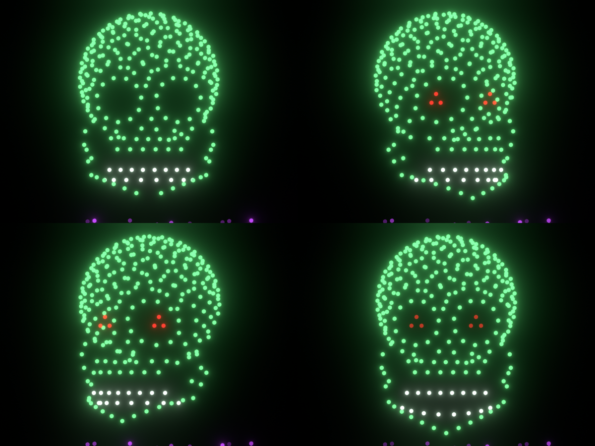

# ハロウィン・ドローンショー「SKULL」— 300機 / 本編30秒 / Blender制作データ

Blender(Skybrushなし・素のBlender)で自動構築した、ハロウィン用ドローンライトショーの
アニメーションデータ。テーマは**3Dスカル**。参考画像(緑のドット・スカル/青いコウモリ/クモ)の
「点群で立体を描く」見せ方を踏襲し、**300機・本編30秒**に収めている。



| ファイル | 内容 |
|---|---|
| `20261031_Halloween_SKULL_Animation_v01.blend` | 完成データ(6.9MB。Blender 4.2以降で開ける。制作は bpy 5.0.1) |
| `build_halloween_skull_show.py` | **構築スクリプト**。Blenderで実行すると同じ .blend を一から生成(.blend内のテキストにも同梱) |
| `verify_and_preview.py` | 安全検証(速度・加速度・最小機体間距離)+ギャラリー/プレビュー動画書き出し(同梱) |
| `show_plan.json` | 尺割り・マーカー・フォーメーション統計・遷移シミュレーション統計 |
| `safety_report.json` | 検証結果(全編 0.125秒刻み・全機・全ペア) |
| `previews/` | Cyclesレンダー(観客視点 `page_*` / スカル拡大 `detail_*` / 地上目線 `ground_*`)、正面ギャラリーSVG、本編30秒のプレビュー動画 `preview_content.mp4` |

## Blender(3D Jutsu)への反映

同じ構築スクリプトをリモートBlender 5.2 LTS(3D Jutsu)で実行し、シーンとして反映済み:
https://higgsfield.ai/3d-jutsu/dd44eeaa-9c69-47f5-a3bc-dee769c8f81b (リビジョン1)。
Web上で回転・再生でき、編集用 .blend(約40MB、パス・エンプティ600個込み)もそこから取得できる。
ローカルのBlenderで開く場合は本フォルダの .blend(6.9MB・圧縮保存)を使えばよい。

## 検証結果(実機閾値: 水平5 / 上昇4 / 下降3 m/s、加速度4 m/s²、機体間1.5m)

| 指標 | 実測 | 設計目標 | 判定 |
|---|---|---|---|
| 最大水平速度 | **2.85 m/s**(首振り時) | 3.0 | OK |
| 最大上昇速度 | 2.37 m/s(遷移) | 2.4 | OK |
| 最大下降速度 | 1.79 m/s(帰投) | 1.8 | OK |
| 最大加速度 | 3.50 m/s²(顎開閉) | 3.8 | OK(閾値4.0以内) |
| 最小機体間距離 | **2.27 m**(全編) | ≥1.8 | OK |
| 飛行高度 | 20.3〜88.1 m | 20〜120 | OK |
| 違反数 / Limit Distanceパッチ | 0 / 0 | — | — |

## タイムライン(24fps・全体170秒、うち本編30秒)

物理的に必要な離陸・遷移・帰投は**消灯**で本編の外に置く。`.blend` は再生範囲(プレビューレンジ)を
本編30秒(フレーム1458〜2178)に設定済み。

| 秒 | フレーム | 内容 |
|---|---|---|
| 0 〜 15 | 0 〜 360 | 離陸: 30×10グリッド(ピッチ3m)から消灯のまま20mへ一斉上昇 |
| 15 〜 60.8 | 360 〜 1458 | 遷移(消灯): スカル各スロットへ(多機体シミュレーションで衝突回避) |
| **60.8 〜 90.8** | **1458 〜 2178** | **本編 スカル 30秒**(下表) |
| 90.8 〜 150.3 | 2178 〜 3608 | 帰投(消灯): 着陸グリッド(離陸グリッドを再利用)へ |
| 150.3 〜 170.3 | 3608 〜 4088 | 降下・着陸 20秒 |

### 本編30秒の振り付け

| 本編内の秒 | 演出 |
|---|---|
| 0 〜 4 | 上から下へスキャンするように点灯(緑)。下の「紫の霧」(30機)はゆっくり明滅 |
| 4.5 〜 | 眼窩の奥で赤い目(各3機)が1.6秒周期で脈動 |
| 5 〜 11 | 頭部を左へ25°(頭部ピボットのZ回転、霧は回さない) |
| 11 〜 19 | 右へ −25° |
| 19 〜 25 | 正面へ戻る |
| 22 〜 28 | 下顎(支点回転)を11°開いて閉じる。開き切るところで目が白く光る |
| 28.5 〜 30 | 1.5秒で消灯 |

スカルの構成(300機): 頭蓋185 / 顔面プレート10 / 眼窩リング22 / 目6 / 鼻腔6 / 頬骨8 / 上歯8 /
下顎17 / 下歯8 / 紫の霧30。幅33×奥行34×高さ56m(霧含む)、点間隔は最小2.27m。
眼窩・鼻腔は**背面まで貫通**させ、点群を透かして見ても穴として読めるようにしている。

## 設計値(スキル「鉄板数値」に準拠)

| 項目 | 値 |
|---|---|
| 機体 | ICO球 subdiv2(42頂点)直径1m・半径0.5m |
| 地上グリッド | 30×10・ピッチ3m(87×27m) |
| 安全距離 | 1.5m(フォーメーション設計は1.8m以上) |
| 絵柄の中心高度 / キャンバス | 65m / 110×50m(観客は −Y 側、距離200m) |
| 速度・加速度の設計値 | 水平3.0・上昇2.4・下降1.8 m/s(上限5/4/3の6割)、加速度3.8 m/s²以内 |
| FPS / 単位 | 24fps / メートル法 1.0、フレーム0=離陸開始、地上待機はフレーム −1 |
| ビュー変換 | 標準(Standard)+コンポジター・グレア Bloom(しきい値0.4/強さ2.8/サイズ0.5) |

## データ構造(プロ300機案件と同じアーキテクチャ)

```
Scene Collection
├── oya/            oya.takeoff(離陸グリッドの親: Z 0→20m)、oya.show(本編の親=会場合わせ用)
├── Templates/      Drone template(ICO球)
├── Drones/         Drone 1..300(各機専用マテリアル「LED color of Drone N」放射ノード・強度1.0)
├── Formations/
│   ├── Takeoff grid/   地上エンプティ×300(離陸・着陸で再利用)
│   ├── 01_Skull/       スロット・エンプティ×300(親=CENTERの空)
│   │     01_Skull.cranium.pivot(頭部=首振り)└ 01_Skull.jaw.pivot(下顎=開閉、頭部の子)
│   └── Paths/          遷移ごとのベイク済みパス・エンプティ(Drone N.path.NN、0.25秒刻みベジエ)
├── Guides/         FlightArea 110x50x100m(ワイヤー表示・レンダー無効・純ガイド)
└── Cameras/        AudienceCam(平行投影・観客距離200m)/ DetailCam(拡大)/ GroundCam(39mm・高さ1.6m・注視点追従)
```

- **機体には直接キーを打たない**。動きは `COPY_LOCATION` の influence 切替で
  「地上 → パス → スロット → パス → 地上」と乗り継ぐ。首振り・顎はピボット側のキーだけで全機が追従。
- **遷移は多機体シミュレーションで生成**(`ShowBuilder._step`)。各機は「直線上をスムーズステップで
  進む参照点」を追従しつつ、近傍機体からの反発で回り込む(予測位置ベース・右手優先バイアス・
  目標付近では反発を切って整列)。速度・加速度は設計値でクリップし、結果をパス・エンプティに焼き込む。
- 機体↔スロットの対応はハンガリアン法(二乗距離最小=交差が減る)で自動割り当て。
- 会場合わせ(位置・回転・スケール)は `oya.show` / `oya.takeoff` で行う(再ベイク不要)。
- 近接が残った場合は Limit Distance(外側)を自動パッチする仕組みあり(今回は0件)。
- タイムラインマーカー(日本語)がそのまま尺割り表。`show_plan.json` と .blend内テキストにも同じ内容。

## 使い方

```bash
# 再生成(Blender GUI: Scriptingワークスペースでテキスト「build_halloween_skull_show.py」を実行でも可)
blender -b -P build_halloween_skull_show.py            # 約30秒。pip版 bpy: python build_halloween_skull_show.py
SHOW_MODE=full blender -b -P build_halloween_skull_show.py   # 長尺版(下記)

# 検証+プレビュー(SHOW_RENDER=0 で安全チェックのみ、SHOW_VIDEO=1 で本編の動画も)
blender -b 20261031_Halloween_SKULL_Animation_v01.blend -P verify_and_preview.py
```

- ビューポートのクリッピング終了は1000mに設定済み(新しい3Dビューを追加した場合は要設定)。
  マテリアルプレビュー表示でLED色が見える。
- 振り付けを変えるときは `page_skull_30s()`(秒数・角度・色が日本語コメント付きで並ぶ)を編集して再実行。
  形を変えるときは `make_skull()` のパラメータ、大きさは `SKULL_SCALE`。
- **Skybrush Studioに載せる場合**: `Formations/01_Skull` のスロット・エンプティをフォーメーションとして
  そのまま登録できる(1エンプティ=1機)。可動パーツ・LED色は本ファイルのキーを参照。
- 実機書き出し(.skyc/.essp 等)は運行システム側の正規ツールで行い、**書き出したデータを必ず再検証**すること。
  本データはアニメーション設計データであり、実飛行の安全審査は別途必要。

## 長尺版(`SHOW_MODE=full`、約8分)

同じスクリプトで、星空間奏をはさんだ7ページ構成も生成できる:
星空(紫)→ ジャック・オー・ランタン(3D・揺れ・ろうそく)→ 星空(緑)→ スカル80秒(360°回転・顎開閉)→
コウモリ(羽ばたき)→ 星空(橙)→「HAPPY HALLOWEEN」(タイプライター点灯)。
星空ページでは90機だけ点灯し、残り210機は消灯のまま次の絵柄へ直行する(プロの遷移文法)。
生成器 `make_pumpkin / make_bat / make_text` はそのまま使える。長尺版の最終検証値は
最大水平3.29・上昇2.35・下降2.31 m/s、加速度4.36 m/s²(コウモリ遷移で閾値4.0を2サンプル超過)、
最小距離1.52m。長尺版を採用する場合はコウモリ遷移の再調整が必要。
